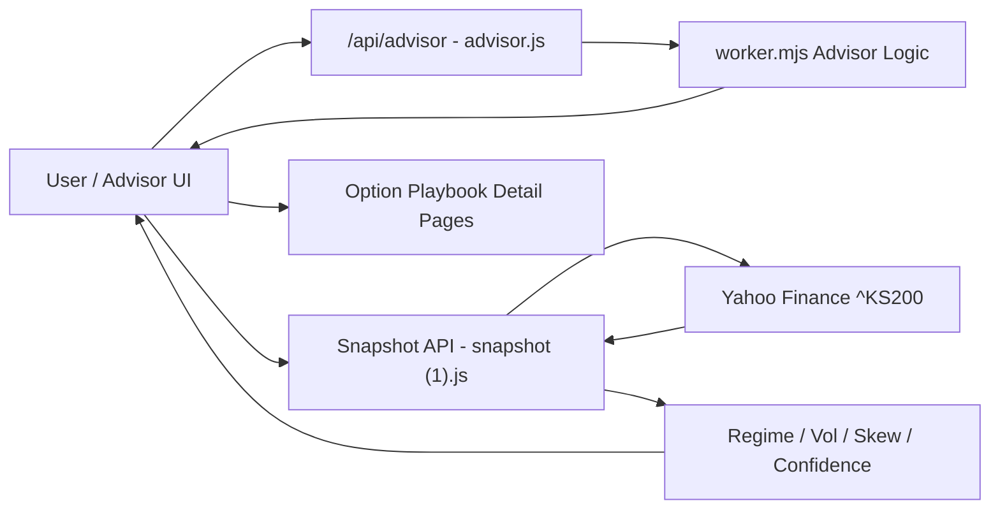
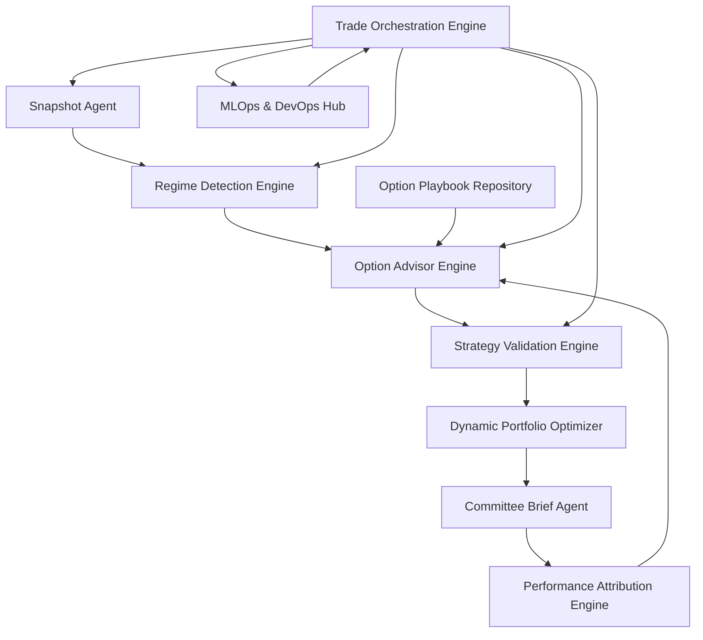

# 6조 아키텍처 설계서 - AI 기반 KOSPI200 Option Playbook Advisor

## 1. 시스템 개요

6조 Option Playbook Advisor는 KOSPI200 시장 데이터를 수집하고, 20일 실현변동성 및 수익률 왜도를 기반으로 시장 레짐을 판단한 뒤, Option Playbook 전략 저장소와 연결하여 추천/회피 전략을 제시하는 Agent 기반 시스템입니다.

현재 코드 기준으로는 다음 두 API 계층이 핵심입니다.

1. `snapshot (1).js`: KOSPI200 실데이터 스냅샷과 레짐 계산
2. `advisor.js`: 기존 Worker 기반 Advisor 로직을 Node/Vercel API로 연결

## 2. 주요 기술 스택

| 영역 | 기술/구성요소 | 역할 |
| :--- | :--- | :--- |
| Frontend | HTML 기반 Option Playbook Advisor 화면 | 시장 상태, 추천 전략, 회피 전략 표시 |
| Serverless API | Node.js API handler | `/api/advisor`, snapshot API 처리 |
| Worker Runtime | `worker.mjs` | Advisor 핵심 로직 재사용 |
| Market Data API | Yahoo Finance public chart API | `^KS200` 일간 가격 데이터 조회 |
| Quant Logic | JavaScript 통계 함수 | 평균, 표준편차, 왜도, 로그수익률, rolling stats 계산 |
| Regime Logic | 변동성 점수 + 왜도 점수 | Regime 1-4 분류 |
| Option Repository | Option Playbook | 48개 KOSPI200 옵션 전략, 손익구조, 백테스트 |
| Validation | Walk-Forward, stress test | 전략 검증 및 리스크 점검 |
| Reporting | LLM Agent | 투자위원회 보고서 초안 생성 |
| Operations | MLOps/DevOps Hub | 오류, 데이터 기준일, 모델 drift, 로그 관리 |

## 3. 현재 코드 모듈 구조



## 4. 데이터 처리 프로세스

## 4.1 Snapshot API Input-Process-Output

### Input

| 입력 | 설명 |
| :--- | :--- |
| `date` query | 사용자가 지정한 기준일. 없으면 현재일 사용 |
| Yahoo Finance `^KS200` | KOSPI200 일간 chart data |
| range | 기본 2년 |
| interval | 기본 1일 |

### Process

| 단계 | 처리 |
| :--- | :--- |
| 1. 기준일 정규화 | 입력 날짜를 ISO 형식 `YYYY-MM-DD`로 변환 |
| 2. 데이터 조회 | Yahoo Finance chart API 호출 |
| 3. 유효 종가 추출 | timestamp와 close가 유효한 데이터만 points로 구성 |
| 4. 기준일 선택 | 요청일 또는 요청일 이전 가장 가까운 거래일 선택 |
| 5. 로그수익률 계산 | `log(curr / prev)` 방식으로 수익률 계산 |
| 6. 20일 실현변동성 | 20일 로그수익률 표준편차에 `sqrt(252) * 100` 적용 |
| 7. 20일 왜도 | 최근 20일 수익률의 skewness 계산 |
| 8. rolling baseline | 최근 60개 rolling stats의 평균/표준편차 계산 |
| 9. 점수화 | 현재 값과 baseline 차이를 -100~100 범위로 scale |
| 10. 레짐 분류 | 변동성 점수와 왜도 점수 부호로 Regime 1-4 결정 |
| 11. confidence 계산 | `hypot(volScore, skewScore) * 0.9`를 0~100 범위로 제한 |

### Output

```json
{
  "source": "Yahoo Finance public chart API",
  "selectedDate": "YYYY-MM-DD",
  "actualDate": "YYYY-MM-DD",
  "k200Close": 0,
  "k200PrevClose": 0,
  "realizedVol20": 0,
  "skew20": 0,
  "volScore": 0,
  "skewScore": 0,
  "confidence": 0,
  "regimeKey": "regime_1",
  "regimeLabel": "Regime 1",
  "regimeSubtitle": "Put skew · High vol",
  "seriesLength": 0
}
```

## 4.2 Advisor API Input-Process-Output

### Input

- 사용자의 `/api/advisor` 요청
- request method
- request headers
- request URL

### Process

| 단계 | 처리 |
| :--- | :--- |
| 1. Worker module load | `worker.mjs`를 동적으로 import |
| 2. Header 변환 | Node request headers를 Fetch API `Headers`로 변환 |
| 3. Request 생성 | origin과 URL을 조합해 Fetch API `Request` 생성 |
| 4. Worker 호출 | `worker.fetch(request)` 실행 |
| 5. 응답 전달 | Worker 응답 status, headers, body를 그대로 client에 전달 |
| 6. 오류 처리 | 실패 시 500 JSON 반환 |

### Output

- Advisor JSON 또는 HTML 응답
- Worker status code
- Worker headers
- 오류 시 `{ "error": "advisor api failed" }` 형태의 JSON

## 5. 8개 Agent 연결 구조



| Agent | 역할 | 현재 코드와의 연결 |
| :--- | :--- | :--- |
| Snapshot Agent | KOSPI200 가격, 변동성, 왜도 계산 | `snapshot (1).js` |
| Regime Detection Engine | Regime 1-4 및 향후 10-state 분류 | `classifyRegime()` |
| Option Advisor Engine | 전략 추천/회피 목록 생성 | `advisor.js` -> `worker.mjs` |
| Option Playbook Repository | 전략별 손익구조/백테스트 제공 | 상세 Playbook 링크 |
| Strategy Validation Engine | 추천 전략 검증 | 향후 백테스트 모듈 |
| Dynamic Portfolio Optimizer | 전략 조합 후보 산출 | 향후 고도화 |
| Performance Attribution Engine | 사후 성과 원인 분석 | 향후 feedback loop |
| MLOps & DevOps Hub | API 오류/데이터 품질/모델 관리 | 500 처리, no-store, 로그 확장 |

## 6. 레짐 설계

현재 MVP는 4개 레짐을 사용합니다.

| 레짐 | 조건 | 해석 | 전략 검토 방향 |
| :--- | :--- | :--- | :--- |
| Regime 1 | Put skew, High vol | 하방 방어 수요와 변동성이 높은 상태 | 보호형 전략, 변동성 대응 전략 우선 |
| Regime 2 | Call skew, High vol | 상방 옵션 수요와 변동성이 높은 상태 | 급등 대응, convex 전략 검토 |
| Regime 3 | Put skew, Low vol | 변동성은 낮지만 하방 경계가 존재 | 방어적 수익형 전략 검토 |
| Regime 4 | Call skew, Low vol | 변동성 낮고 상방 기대가 있는 상태 | 완만한 상승/수익형 전략 검토 |

향후 PDF 요구서에 따라 Bull/Calm, Bear/Crisis, Transition 또는 10-state 변동성 모델로 확장할 수 있습니다.

## 7. 예외 처리 설계

| 상황 | 현재 코드 처리 | 추가 설계 방향 |
| :--- | :--- | :--- |
| Snapshot GET 외 method | 405 반환 | 화면에 "지원하지 않는 요청" 표시 |
| Yahoo Finance 실패 | 500 JSON 반환 | fallback 데이터 또는 재시도 버튼 |
| 데이터 부족 | "Not enough historical data" 오류 | 추천 보류, 기준일 변경 안내 |
| 가격 데이터 없음 | "No price points" 오류 | 데이터 출처 점검 표시 |
| Advisor Worker 실패 | 500 JSON 반환 | 운영 로그 기록, Playbook fallback |
| confidence 낮음 | 현재 숫자 반환 | 추천을 "확정"이 아닌 "검토 후보"로 표시 |

## 8. 보안 및 운영 고려사항

- API 응답은 `Cache-Control: no-store`를 사용해 오래된 시장 데이터 노출을 줄입니다.
- Yahoo Finance public API 의존성이 있으므로 장애 시 fallback 정책이 필요합니다.
- Worker module 경로가 배포 구조와 맞아야 하므로 배포 전 경로 검증이 필요합니다.
- Advisor 추천 결과는 투자판단이 아니라 검토자료 초안으로 표시해야 합니다.
- 모든 보고서에는 데이터 기준일과 실제 데이터일을 함께 표시해야 합니다.

## 9. 아키텍처 핵심 메시지

6조 시스템은 현재 구현 코드 기준으로 시장 스냅샷 API와 Advisor Worker 연동 구조를 이미 갖춘 MVP입니다. 향후에는 이 구조 위에 48개 전략 저장소, 백테스트 검증, 성과 귀인, MLOps 운영관리 기능을 단계적으로 확장하면 됩니다.
